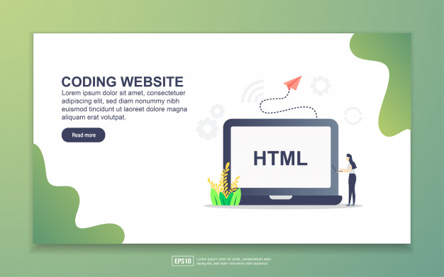

<html>
<head>
	<title>DIGITAL MARKETING</title>
	<link rel="icon" href="favicon.ico">
	<link rel="stylesheet" type="text/css" href="style.css">

</head>
<body>
	

		
	    <h1 class="header1">WELCOME TO INFINITE CLICKS</h1>
        
A photography and a programming inc.

        
        
        

  

  

    
    <h2>Hello</h2>
    
We're team infinite clicks..... A photography and a marketing team. We also work on certain events like family events(birthday events, wedding events etc....) dm us for further information...!!!

  

  

  

    <h2>My Skills.</h2>
    

      
      <h3>Photography skills</h3>
      
 Photography is my passion which will make me feel completely relaxed..... Not everyone who captures a pic cannot a professional photographer....

      
      <h3>Coding skills</h3>
      
I've started coding after completing my schooling. I thought it would be difficult at first but later on i came to know that its very interesting than i thought.

    
   
  

  

  

    <h2>Get In Touch</h2>
    <h3>With infinite clicks.</h3>
    
Follow @infinite_clicks20 on instagram.

    <a class="btn" href="infiniteclicks07@gmail.com">CONTACT ME</a>
  

  <a class="footer-link" href="https://www.instagram.com/__.t._e._j._e._s._h.__/">Instagram</a>
  <a class="footer-link" href="https://twitter.com/Tejeshwaran4">Twitter</a>
  <a class="footer-link" href="https://www.facebook.com/profile.php?id=100011040630369">Facebook</a>
  
© 2020 Team Infinite Clicks.

	
</body>
</html>
